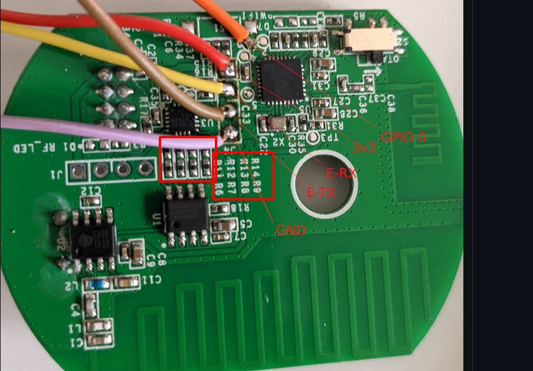

# Sonoff D1 Dimmer switch with MQTT and Thingsboard
Sonoff D1 Dimmer Arduino source code over MQTT using [ThingsBoard](https://thingsboard.io/) (Has implemented by reverse engineering the switch functionality)

## Contents
1. Sonoff D1 Dimmer
2. Flashing
3. Requirements

#### Sonoff D1 Dimmer
SONOFF D1 Smart Dimmer Switch is a Wireless LED Light Dimmer Switch that can easily turn on/off, brighten and dim the connected dimmable LED lights.

#### Flashing
For flashing the Sonoff Basic, hold the button while connecting the 3.3V power. The LED remains off until the flashing process is done and the board is rebooted.
For more information read instruction from [this link](https://github.com/arendst/Tasmota/issues/7598) carefully.

#### Requirements
Open Arduino IDE and go to Sketch -> Include Library -> Manage Libraries. Find and install the following libraries:

1. [PubSubClient 2.6 by Nick O’Leary](http://pubsubclient.knolleary.net/)
2. [ArduinoJson 5.8.0 by Benoit Blanchon](https://github.com/bblanchon/ArduinoJson)

Happy coding!!!
